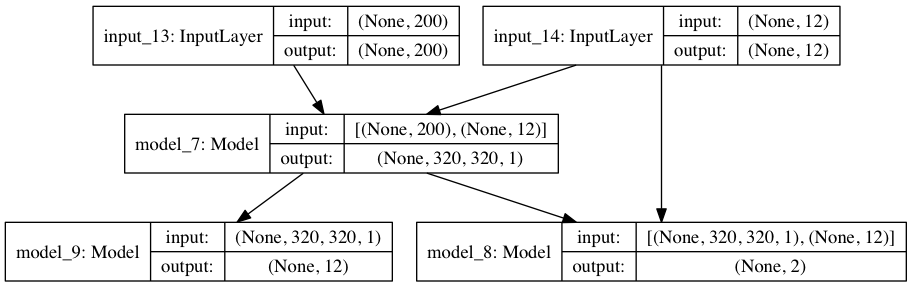

# PDTG-keras
the implementation of PERCEPTION DRIVEN TEXTURE GENERATION

### Abstruct
This paper investigates a novel task of generating texture images from perceptual descriptions. Previous work on texture generation focused on either synthesis from examples or generation from procedural models. Generating textures from perceptual attributes have not been well studied yet. Meanwhile, perceptual attributes, such as directionality, regularity and roughness are important factors for human observers to describe a texture. In this paper, we propose a joint deep network model that combines adversarial training and perceptual feature regression for texture generation, while only random noise and user-defined perceptual attributes are required as input. In this model, a preliminary trained convolutional neural network is essentially integrated with the adversarial framework, which can drive the generated textures to possess given perceptual attributes. An important aspect of the proposed model is that, if we change one of the input perceptual features, the corresponding appearance of the generated textures will also be changed. We design several experiments to validate the effectiveness of the proposed method. The results show that the proposed method can produce high quality texture images with desired perceptual properties.

### Architecture

### Environment
- OSX El Captain(10.11.4)
- anaconda-2.4.3.2
- libraries
  - keras
  - pillow
  - tqdm

### Reference
- [arXiv page](https://arxiv.org/pdf/1703.09784.pdf)
